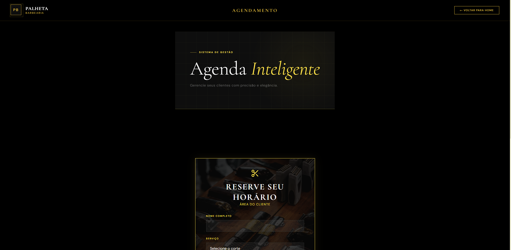
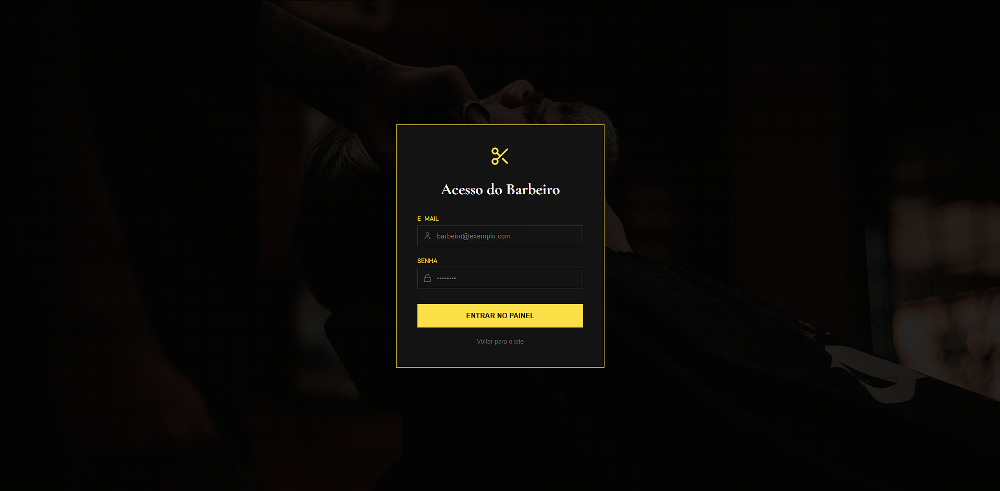
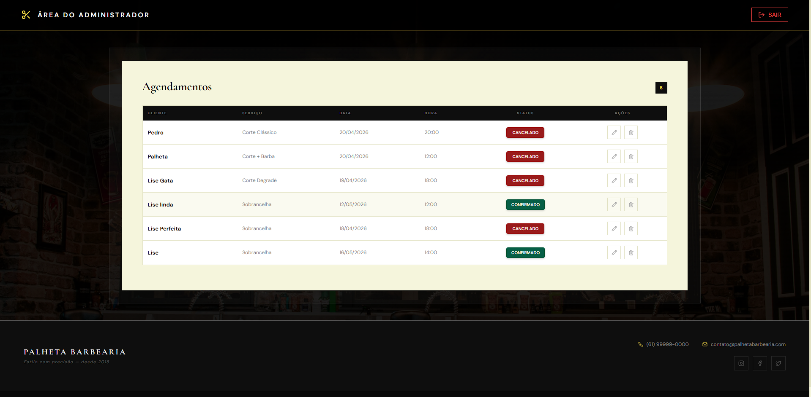
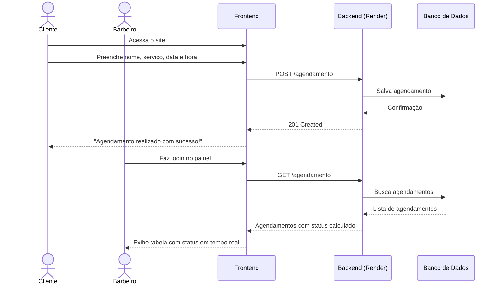
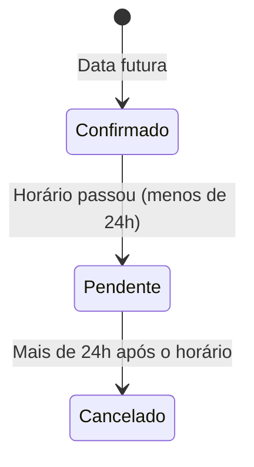

<div align="center">


#  PALHETA BARBEARIA
### Sistema de Agendamento Online

[](https://reactjs.org/)
[](https://vitejs.dev/)
[](https://nodejs.org/)
[](https://spring.io/)
[](https://vercel.com/)
[](https://render.com/)

**Plataforma web fullstack para agendamento de serviços de barbearia.**  
O cliente agenda seu horário online e o barbeiro gerencia todos os agendamentos pelo painel administrativo.

##  Acesso para Demo

| Perfil | E-mail | Senha |
|--------|--------|-------|
|  Barbeiro | barbeiro@palheta.com | sua_senha |

> Conta de demonstração. Por favor, não altere os agendamentos existentes.
[ Ver Demo ao Vivo](https://agendamento-seven.vercel.app)

</div>

---

##  Capturas de Tela

###  Landing Page


###  Agendamento — Área do Cliente


###  Login do Barbeiro


###  Painel Administrativo


###  Versão Mobile
<div align="center">
  
</div>

---

##  Sobre o Projeto

O **Palheta Barbearia** é um sistema web de agendamento desenvolvido para facilitar a gestão de horários entre clientes e barbeiros.

O cliente acessa o site, escolhe o serviço, a data e o horário e confirma o agendamento — tudo sem precisar de cadastro. O barbeiro faz login no painel administrativo e visualiza todos os agendamentos com status em tempo real.

---

##  Funcionalidades

###  Cliente
-  Agendar horário com nome, serviço, data e hora
-  Sem necessidade de cadastro ou login
-  Interface responsiva para mobile e desktop

###  Barbeiro (Administrador)
-  Login seguro no painel administrativo
-  Visualização de todos os agendamentos em tempo real
-  Editar agendamentos existentes
-  Cancelar/deletar agendamentos
-  Status automático por horário:

| Status | Condição |
|--------|----------|
| ✅ **Confirmado** | Data futura — agendamento válido |
| ⏳ **Pendente** | Horário já passou mas menos de 24h |
| ❌ **Cancelado** | Mais de 24h após o horário agendado |

---

##  Arquitetura

```
PALHETA BARBEARIA
├── Frontend (React + Vite)  →  Vercel
│   ├── LandingPage      — Página inicial com portfólio
│   ├── FormPanel        — Formulário de agendamento do cliente
│   ├── BarbeiroLogin    — Autenticação do barbeiro
│   └── AdminDashboard   — Painel com lista de agendamentos
│
└── Backend (Node.js + Express)  →  Render
    └── /agendamento
        ├── GET    →  Listar agendamentos
        ├── POST   →  Criar agendamento
        ├── PUT    →  Editar agendamento
        └── DELETE →  Deletar agendamento
```

---

##  Diagrama UML

### Fluxo do Sistema



### Status dos Agendamentos



---

##  Stack Tecnológica

| Camada | Tecnologia | Função |
|--------|-----------|--------|
| Frontend | React + Vite | Interface do usuário |
| Estilização | CSS Modules + Custom CSS | Design premium dark theme |
| Backend | Node.js + Express | API REST de agendamentos |
| Deploy Frontend | Vercel | Hospedagem do frontend |
| Deploy Backend | Render | Hospedagem do servidor |

---

##  Como Rodar Localmente

### Pré-requisitos
- Node.js 18+

### Frontend

```bash
# Clone o repositório
git clone https://github.com/seu-usuario/palheta-barbearia.git

# Entre na pasta do frontend
cd frontend

# Instale as dependências
npm install

# Rode o projeto
npm run dev
```

### Backend

```bash
# Entre na pasta do backend
cd backend

# Instale as dependências
npm install

# Configure as variáveis de ambiente
cp .env.example .env

# Rode o servidor
npm start
```

---

##  Estrutura de Pastas

```
palheta-barbearia/
├── frontend/
│   └── src/
│       ├── components/     # Navbar, Hero, FormPanel, AdminDashboard...
│       ├── styles/         # CSS global e módulos
│       └── constants/      # Constantes do formulário
│
└── backend/
    └── src/
        ├── routes/         # agendamento.java
        ├── controllers/    # agendamentoController.java
        └── models/         # Agendamento.java
```

---

##  Autor

<div align="center">

**Pedro Palheta**  
Desenvolvedor Full Stack

[](https://www.linkedin.com/in/pedro-palheta-b81017321/)
[](https://github.com/Palhetaspedro)

</div>

---

<div align="center">
  <sub>Desenvolvido com 🖤 por Pedro Palheta</sub>
</div>
